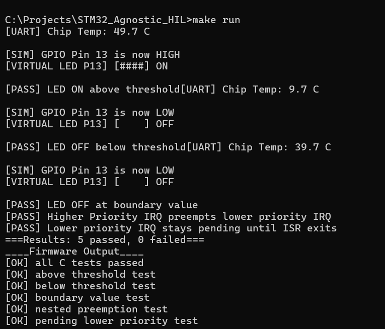

[](https://github.com/Rathi2323/STM32-Agnostic-HIL/actions/workflows/ci.yml)

# STM32 Hardware-Agnostic Firmware with Simulated Verification

Firmware framework that runs on both STM32 hardware and a PC-based simulator, enabling hardware-independent development, testing, and CI validation.

## Key Highlights

- Runs on BOTH STM32 hardware and PC simulation
- Hardware abstraction via HAL interfaces
- Full simulation layer for GPIO, UART, and sensor inputs
- CI pipeline validates firmware without physical hardware
- Python-based automated output verification

## Sample output (simulation)


## What this project demonstrates
- Hardware abstraction separating logic from hardware details
- Simulated peripherals (GPIO, sensor) for host-based testing
- Automated firmware verification through C tests
- Python output validation layer
- CI pipeline via GitHub Actions for automated build and test

## Architecture Overview
```
Application Logic (app/main_logic.c)
        ↓
HAL Interface (common/hal_io.h)
        ↓
-------------------------------
| STM32 Backend | SIM Backend |
-------------------------------
        ↓
Hardware / PC Simulation
```
## Agnostic HAL Architecture
The application logic lives in `app/main_logic.c` and only calls generic
functions from `common/hal_io.h`, such as `HAL_GPIO_WritePin`,
`HAL_UART_Print`, and `HAL_ReadSensor`.

The hardware-specific behavior is implemented in separate backends:
- `hw_stm32/hw_stm32.c` drives the real STM32F407 peripherals.
- `hw_sim/hw_sim.c` drives PC-side mocks, including the virtual LED output.

The host simulator build defines `TARGET_SIM`, so simulation-only test helpers
such as `HAL_SetMockSensor`, `HAL_GetMockPinState`, and nested IRQ simulation
APIs are available only for the PC test build.

## Project Structure
```
common/       → HAL interface contract (hal_io.h)
app/          → Hardware-agnostic firmware logic
hw_stm32/     → Real STM32F407 hardware implementation
hw_sim/       → PC simulator implementation
tests/        → Automated test suite
```

## Running on host (no board needed)
Requirements: gcc, make, python
```
make sim      # build simulator
make run      # build, run tests and validate output
make clean    # remove binary
```
## Running on STM32F407
Open STM_Agnostic_HIL/ in STM32CubeIDE and flash normally.
Tested on STM32F407G-DISC1 Discovery board.

## Hardware Switching

- Build with `make sim` → runs on PC using simulated hardware
- Build for STM32 → runs on real hardware
- No changes required in application logic

## Technologies
Embedded C, Makefile, GitHub Actions, Python
